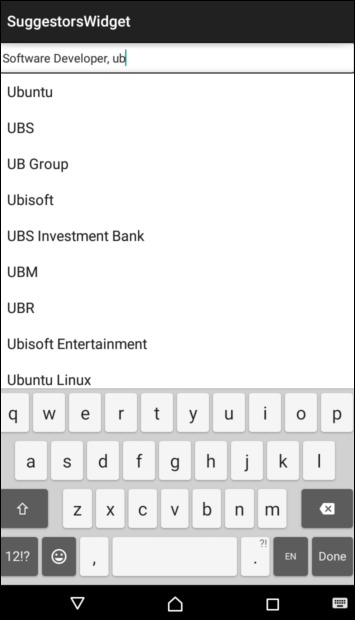

This library provides a widget named `CustomAutoCompleteEditText`  that shows completion suggestions
   automatically while the user is typing. The list of suggestions is displayed in a drop down menu from which the user can choose an 
   item to replace the content of the edit box with.
 

 The library includes following features and functionalities :
 - Obtain list of suggestions from a given url
 - Support for multiple substrings separated with defined tokens
 - Cache the url responses automatically. Please note that the URL should return appropriate `cache-control` header for caching to work.
 - Invalidate cache even before the items have expired.
    
    
   
  To make the library more generic we have given following interfaces which you can implement accordingly : 
- `ParsingListener` : Implement its `parseApiResponse` method with your own way of parsing api responses.
-  `URLQueryListener` : Use this interface to generate your own url queries .

 
 Provide these interfaces using the setter methods:
  - `ParsingListener` : `setParsingListener(ParsingListener)`
  - `URLQueryListener` : `setUrlQueryListener(URLQueryListener)`
  - `Loading Indicator` : `setLoadingIndicator(Loading Indicator)`

 Custom Attributes which you have to define in layout xml while creating an CustomAutoCompleteEditText instance :
  - `threshhold`:  The minimum no. of characters that should be typed to display list of suggestions.
  - `delayTime`: The time (in milliseconds) to wait before hitting the URL. This prevents overloading the backend when user types continuously.
  - `tag` : A unique identifier of your requests. Also, if you plug multiple such widgets on one screen, it is used to identify 
           different parsing formats and urlQueryGenerators while parsing at runtime for different suggestors.  
          

**Sample Usage**

  The following code snippet shows how to create and use a CustomAutoCompleteEditText which suggests
  various keywords while the user is typing.
  
 ```java 
  public class MainActivity extends ActionBarActivity {
	@Override
	protected void onCreate(Bundle savedInstanceState) {
		super.onCreate(savedInstanceState);
		mContext = this.getApplicationContext();
		setContentView(R.layout.activity_main);
		
		mCustomEditText = (CustomAutoCompleteEditText) findViewById(R.id.designationEditTextView);
		mCustomEditText.setRawInputType(InputType.TYPE_TEXT_FLAG_AUTO_COMPLETE);
		mCustomEditText.setTokenizer(new MultiAutoCompleteTextView.CommaTokenizer());
		mButton = (Button) findViewById(R.id.invalidate_cache);
        mCustomEditText.clearVolleyCache();
        mCustomEditText
				.setLoadingIndicator((ProgressBar) findViewById(R.id.pb_loading_indicator));
		mParsingListener = new ParsingListener<JSONObject>() {
			@Override
			public void parseApiResponse(JSONObject response) {
				try {
					JSONObject resultList = response
							.getJSONObject("myResult");
					JSONArray myArray = resultList.getJSONArray("myArray");
					mCustomEditText.updateSuggestorList(myArray);
				} catch (JSONException e) {
					e.printStackTrace();
				}
			}
		};
		mCustomEditText.setparsingListener(mParsingListener);
		mUrlQueryListener = new UrlQueryListener<String>() {
			@Override
			public void setUrlQuery(String searchParam) {
				StringBuilder urlQuery = new StringBuilder(mSuggestersUrlPrefix);
				urlQuery.append(mSuggestersUrlPrefix).append(myParams);
				mCustomEditText.updateSuggestorUrlQuery(urlQuery.toString());
			}
		};
		mCustomEditText.setUrlQueryListener(mUrlQueryListener);
	}
```

 The following code snippet shows how to create an xml layout for this AutoCompleteEditText
```xml
 <RelativeLayout xmlns:android="http://schemas.android.com/apk/res/android"
    xmlns:app="http://schemas.android.com/apk/res/com.naukri.suggestorwidget"
    xmlns:tools="http://schemas.android.com/tools"
    android:layout_width="match_parent"
    android:layout_height="match_parent"
    android:descendantFocusability="beforeDescendants"
    android:focusableInTouchMode="true"
    tools:context="com.naukri.suggestorswidget.MainActivity" >
   <com.naukri.suggestorwidget.CustomAutoCompleteEditText
        android:id="@+id/designationEditTextView"
       android:imeOptions="actionDone"
        android:inputType="textCapSentences"
        android:typeface="normal"
        app:threshhold="2"
        app:delayTime="500"
        app:tag="naukri" />
    <ProgressBar
        android:id="@+id/pb_loading_indicator"
        style="?android:attr/progressBarStyleSmall"
        android:layout_alignParentRight="true"
        android:layout_marginTop="10dp"
        android:visibility="gone" />
 </RelativeLayout>
```
Screenshots
===========



Contact Us
===========
engineering@naukri.com

Contributors
=============
Vishakha Tyagi

Varun Bhardwaj

Minni Arora

LICENSE
========
Copyright(c) 2015 Naukri.com

Permission is hereby granted, free of charge, to any person obtaining a copy of this software and associated documentation files (the "Software"), to deal in the Software without restriction, including without limitation the rights to use, copy, modify, merge, publish, distribute, sublicense, and/or sell copies of the Software, and to permit persons to whom the Software is furnished to do so, subject to the following conditions:

The above copyright notice and this permission notice shall be included in all copies or substantial portions of the Software.

THE SOFTWARE IS PROVIDED "AS IS", WITHOUT WARRANTY OF ANY KIND, EXPRESS OR IMPLIED, INCLUDING BUT NOT LIMITED TO THE WARRANTIES OF MERCHANTABILITY, FITNESS FOR A PARTICULAR PURPOSE AND NONINFRINGEMENT. IN NO EVENT SHALL THE AUTHORS OR COPYRIGHT HOLDERS BE LIABLE FOR ANY CLAIM, DAMAGES OR OTHER LIABILITY, WHETHER IN AN ACTION OF CONTRACT, TORT OR OTHERWISE, ARISING FROM, OUT OF OR IN CONNECTION WITH THE SOFTWARE OR THE USE OR OTHER DEALINGS IN THE SOFTWARE.

ACKNOWLEDGEMENT
===============
This product includes Volley downloaded from https://android.googlesource.com/platform/frameworks/volley which is licensed under the Apache License, Version 2.0
